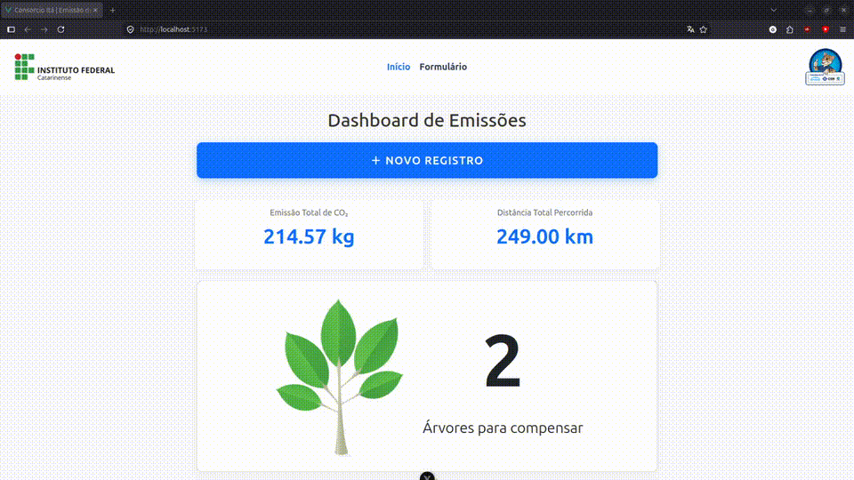

<div align="center">


&nbsp;&nbsp;&nbsp;&nbsp;&nbsp;&nbsp;&nbsp;&nbsp;


# CICC — Carbon Impact Calculator

**Interactive kiosk system for ecological awareness and carbon footprint calculation.**  
Tracking commute emissions and translating raw data into reforestation targets.

[](https://python.org)
[](https://flask.palletsprojects.com)
[](https://vuejs.org)
[](https://vitejs.dev)
[](https://sqlite.org)
[](https://postgresql.org)
[](https://docs.pylonsproject.org/projects/waitress)
[](https://docs.pydantic.dev)
</div>

---

<div align="center">
  
</div>

---

## Overview

**CICC (Calculadora de Impacto de Carbono)** is an interactive application engineered for **standalone self-service kiosks** and informational displays. Developed in partnership between **Consórcio Itá** and **Instituto Federal Catarinense (IFC - Campus Concórdia)**, the system visualizes the direct environmental impact of daily commutes.

Upon logging a trip, the engine calculates carbon dioxide ($CO_2$) emissions using official conversion factors cross-referenced by vehicle category, engine/fuel type, and passenger occupancy. Aggregated entries populate a live analytics dashboard that projects the **reforestation offset requirement** (calibrated at 7 trees per metric ton of $CO_2$).

Engineered for **operational fault tolerance and low resource footprints**, the kiosk runs without Docker or heavy background daemons, recovering into ready state in under 3 seconds following a power cycle.

### Key Features

* **Parameterized Emission Calculations:** Dynamic mathematical calculations accounting for category (car, motorcycle, bus), fuel type (flex, standard gasoline, ethanol, diesel), and vehicle occupancy.
* **Real-Time Analytics Dashboard:** Instant visualization of cumulative $CO_2$, total distance logged, and interactive data charts driven by D3.js.
* **Ecological Offset Projections:** Real-time tree count estimation required to neutralize aggregate emissions.
* **Native Kiosk Execution:** Full-screen execution scripts for Chromium-based runtimes (Edge/Chrome) with touch optimization, disabled shortcut escape vectors, and no browser UI chroming.
* **Inactivity Auto-Reset:** State resets after 60 seconds of idle time, recycling the view back to the welcome interface.
* **Hybrid Storage Architecture:** Toggle between lightweight embedded **SQLite** (configured with WAL mode for write safety against unexpected power loss) and **PostgreSQL**.
* **Triple-Vector Data Export:**
  * **On-Screen Secret Trigger:** Tapping the Consórcio Itá footer logo 5 consecutive times invokes a PIN-gated CSV download modal.
  * **Standalone CLI Script:** Dedicated tool (`python backend/export_emissions.py`) to extract localized CSV sheets directly on disk.
  * **Local Network Endpoint:** Secure PIN-authenticated HTTP endpoint for remote administration over LAN.

---

## System Architecture

The codebase follows a clean layered structure (**Controller -> Service -> Database Adapter**), separating business validation and storage drivers from HTTP routing and UI components.


```

CICC/
├── assets/                  # Demonstration media and visual assets
│   └── cicc_record.mp4
├── backend/                 # Flask RESTful service layer
│   ├── database/            # Database engine adapters (SQLite WAL / PostgreSQL)
│   ├── services/            # Domain logic and analytics aggregations (EmissionService)
│   ├── schemas/             # Pydantic schemas for data integrity and input validation
│   ├── routes/              # Modular REST controllers (Flask Blueprints)
│   ├── utils/               # CO₂ emission factors mathematical engine
│   ├── export_emissions.py  # Standalone CSV extraction CLI utility
│   └── server.py            # Multithreaded production WSGI entrypoint (Waitress)
├── frontend/                # Vue 3 SPA client
│   ├── src/
│   │   ├── components/      # UI components (Dashboard, Form, D3 Charts, Footer)
│   │   ├── services/        # Centralized HTTP abstraction layer
│   │   ├── constants/       # Categorical definitions and conversion coefficients
│   │   └── composables/     # Touch kiosk composables (useInactivityTimeout)
│   └── dist/                # Production static assets served by Flask
├── start.bat                # 1-Click production launch for Windows (Waitress + Edge Kiosk)
├── dev.bat                  # Local dual-process development runner (Flask + Vite)
├── start.sh                 # 1-Click production launch for Linux
└── .env.example             # Environment configuration baseline

```

---

## Tech Stack

| Layer | Technology | Purpose |
|---|---|---|
| **Frontend Framework** | Vue.js 3 (Composition API) | Reactive single-page application and modular interface |
| **Frontend Build Tool** | Vite 7 | Fast module bundler and local HMR runtime |
| **Data Visualization** | D3.js v7 | Custom interactive pie, donut, and bar chart generation |
| **Styling** | Bootstrap 5 + Scoped CSS | Touch-first responsive layouts and presentation components |
| **Backend Framework** | Python 3.12 + Flask 3.1 | RESTful API endpoints and static SPA delivery |
| **Production WSGI** | Waitress 3.0 | Multithreaded, pure-Python WSGI server for Windows/Linux |
| **Validation Engine** | Pydantic v2 + Pyright | Strict runtime input validation and static typing |
| **Default Storage** | SQLite 3 (WAL Mode) | Embedded database engine with high concurrency protection |
| **Enterprise Storage** | PostgreSQL 16 via Psycopg 3 | Optional relational driver for remote infrastructure |

---

## Getting Started

### Prerequisites
* [Python 3.10+](https://python.org)
* [Node.js 18+](https://nodejs.org) *(Build dependency only)*

---

### Installation

#### 1. Clone the repository
```bash
git clone [https://github.com/vichsort/CICC.git](https://github.com/vichsort/CICC.git)
cd CICC

```

#### 2. Configure the virtual environment

```bash
python3 -m venv .venv

# On Windows:
.venv\Scripts\activate

# On Linux/macOS:
source .venv/bin/activate

```

#### 3. Install backend dependencies

```bash
pip install -r backend/requirements.txt

```

#### 4. Compile the frontend client

```bash
npm --prefix frontend install
npm --prefix frontend run build

```

---

### Running the Application

#### 1. Kiosk / Production Mode (Recommended)

* **Windows:** Double-click **`start.bat`**.
*Launches the Waitress WSGI process in the background, spins up the application server, and initiates Microsoft Edge in full-screen (`--kiosk`) mode.*
* **Linux:** Run the shell launcher:
```bash
chmod +x start.sh
./start.sh

```


#### 2. Development Mode (Hot-Reload)

* **Windows:** Double-click **`dev.bat`**.
* **Manual Setup (Cross-Platform):**
```bash
# Terminal 1 - Backend:
flask --app backend.app run --debug --port 5000

# Terminal 2 - Frontend:
npm --prefix frontend run dev

```


---

## Environment Configuration

Copy the baseline template to initialize your configuration:

```bash
cp .env.example .env

```

| Variable | Default | Purpose |
| --- | --- | --- |
| `DB_TYPE` | `sqlite` | Active database engine (`sqlite` or `postgres`) |
| `SQLITE_FILE` | `database.sqlite3` | Disk path for the embedded SQLite database |
| `ADMIN_PIN` | `1234` | Passcode for UI secret trigger and `/export` endpoints |
| `PORT` | `5000` | Application server binding port |
| `DB_HOST` | `localhost` | PostgreSQL host address *(when `DB_TYPE=postgres`)* |
| `DB_PORT` | `5432` | PostgreSQL network port *(when `DB_TYPE=postgres`)* |
| `DB_NAME` | `emissions_db` | Target PostgreSQL database name |
| `DB_USER` | `postgres` | Database authentication username |
| `DB_PASSWORD` | `strong_password` | Database authentication credentials |

---

## Data Export Workflows

1. **Kiosk Touch UI Secret Trigger:**
* Tap the **Consórcio Itá logo in the footer 5 consecutive times**.
* Provide the configured `ADMIN_PIN` (default: `1234`).
* Trigger direct client-side CSV download.


2. **Local CLI Tooling:**
```bash
python backend/export_emissions.py

```


*Generates an `emissions_YYYY-MM-DD.csv` payload formatted for immediate spreadsheet imports.*
3. **LAN HTTP Request:**
* Fetch `http://<KIOSK-IP>:5000/api/emission/export?pin=1234` from any authenticated client within the local subnet.


---

## API Reference

| Method | Endpoint | Description |
| --- | --- | --- |
| `POST` | `/api/emission/` | Logs a commute record and computes corresponding $CO_2$ output |
| `GET` | `/api/emission/` | Fetches historical emission records |
| `GET` | `/api/emission/co2/` | Aggregates cumulative $CO_2$ output and tree offset projections |
| `GET` | `/api/emission/km/` | Returns cumulative recorded travel distance |
| `GET` | `/api/emission/vehicles/` | Lists logged vehicle distribution data |
| `GET` | `/api/emission/fuels/` | Lists logged fuel type distribution data |
| `POST` | `/api/emission/verify-pin` | Verifies administrative credentials |
| `GET` | `/api/emission/export` | Generates CSV export stream (`?pin=...` or `X-Admin-Pin` header) |

---

## Project Credits

* **Sponsors & Organizations:** [Consórcio Itá](https://consorcioita.com.br) & [Instituto Federal Catarinense (IFC)](https://concordia.ifc.edu.br)
* **Development Team:**
* [Gabriel Moura Jappe](https://github.com/jappejappe) ([@jappejappe](https://github.com/jappejappe))
* [Gustavo Schwitzki Peretti](https://github.com/GustavoPeretti) ([@GustavoPeretti](https://github.com/GustavoPeretti))
* [Vitor Marcelo Mignoni](https://github.com/vichsort) ([@vichsort](https://github.com/vichsort))
* Heitor Scalco Neto


---
